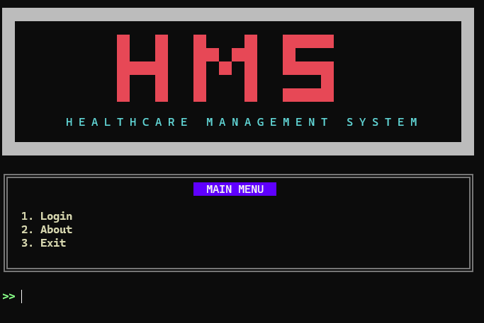
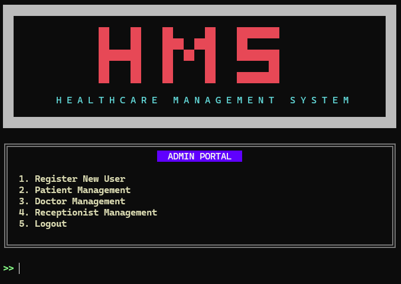
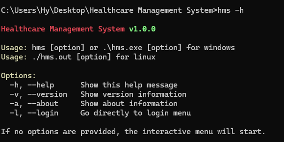

# Healthcare Management System

A console-based Hospital Management System built in C. User-friendly interface.

## Features

- **Authentication** - Role-based access (Admin, Doctor, Receptionist)
- **Patient Management** - Add, view, search, update, delete patients
- **Doctor Management** - Coming soon
- **Data Persistence** - File-based storage (coming soon)

## Interface Design

> Beautiful ASCII art interface with colored console output

<table>
<tr>
<td align="center"><b>Main Menu</b></td>
<td align="center"><b>Admin Portal</b></td>
<td align="center"><b>CLI Usage</b></td>
</tr>
<tr>
<td></td>
<td></td>
<td></td>
</tr>
</table>

## Build & Run

### Windows

First clone the project repository:

```bash
git clone https://github.com/AmiValoHoteChai/Hospital-Management-System.git
```

Navigate to the project directory:

```bash
cd Hospital-Management-System
```

To build the project, run the following command:

```bash
gcc -o hms.exe main.c src/admin.c src/appointment.c src/auth.c src/doctor.c src/doctor_portal.c src/hospital.c src/patient.c src/receptionist.c src/ui.c src/utils.c
```

To run the project, run the following command:

```bash
.\hms.exe
```

### Linux/Mac

First clone the project repository:

```bash
git clone https://github.com/AmiValoHoteChai/Hospital-Management-System.git
```

Navigate to the project directory:

```bash
cd Hospital-Management-System
```

To build the project, run the following command:

```bash
gcc -o hms.out main.c src/admin.c src/appointment.c src/auth.c src/doctor.c src/doctor_portal.c src/hospital.c src/patient.c src/receptionist.c src/ui.c src/utils.c
```

To run the project, run the following command:

```bash
./hms.out
```

## Testing

### Windows

To compile and run the utility tests:

```bash
gcc -o tests/utils_test.exe tests/utils_test.c src/utils.c
.\tests\utils_test.exe
```

### Linux/Mac

To compile and run the utility tests:

```bash
gcc -o tests/utils_test tests/utils_test.c src/utils.c
./tests/utils_test
```

## Project Structure

```
├── assets/      # Assets like screenshots
├── data/        # Data storage
├── docs/        # Documentation
├── include/     # Header files
├── logs/        # Logs
├── src/         # Source files
├── tests/       # Test files
├── .gitignore   # Git ignore file
├── README.md    # README file
├── main.c       # Main file

```

## Tech Stack

- Language: C
- UI: ANSI escape codes for colored console output
- Storage: Binary files (.dat) (coming soon)

## License

MIT License

## Contact

Zunait Hossain Ratul - 251-35-362@diu.edu.bd

## Contributing

Contributions are welcome! Please read the [CONTRIBUTING.md](CONTRIBUTING.md) file for more information.
